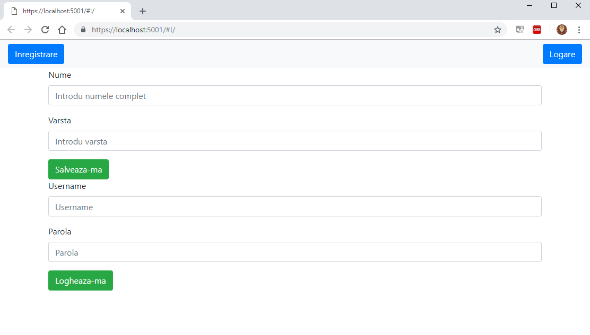
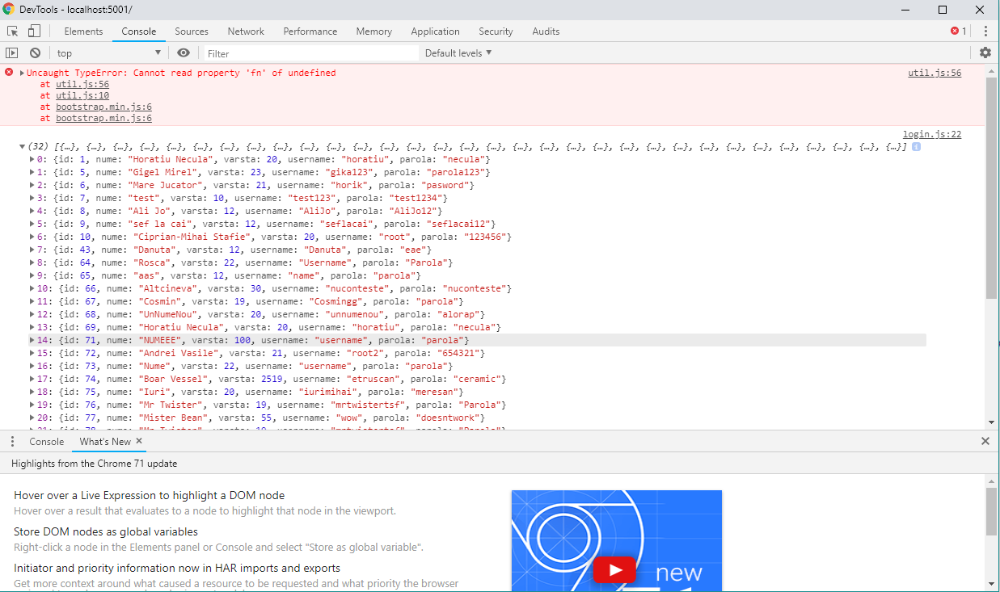

## Hei, salut

Sunt tot eu Horațiu, poate că m-ai văzut luni la workshop, poate că nu. Având în vedere că nu am reușit să termin tot ce mi-am propus am zis să iau totul de la capăt dar de această dată într-un ritm mai lent.

Well, ne propunem să realizăm primii pași în back-end și front-end, puțin și entity framework. Vom învăța despre modele, view-uri și controlăre. La final vom avea o mica aplicație prin care ne putem crea un cont iar mai apoi să ne logăm.

Înainte să facem set-up și să trecem la cod recomand să citiți documentația de mai jos, realizată de colegii mei.
[C# și ASP.NET](https://drive.google.com/drive/u/1/folders/1txn7mG5CfFEbXFMJWlhkFHDR5scej55z) și 
[AngularJS](https://drive.google.com/drive/u/1/folders/1txn7mG5CfFEbXFMJWlhkFHDR5scej55z)

### De ce avem nevoie

[Visual studio 2015 +](https://visualstudio.microsoft.com/vs/community/) cu extensie de .Net CORE. Foarte important să nu uitați să bifași la instalare ASP.NET and web dev și Azure dev. În caz ca deja avți visual-ul instalat pentru a modifica ceva mergeți în Control Panel / Visual studio 2017 / Modify


[Postman](https://www.getpostman.com/) 

Cont pe [Azure for students](https://azure.microsoft.com/en-us/free/students/) cu emailul de student
În caz că nu ești student sau din orice alt motiv nu îți poți face cont acolo te vei folosi de credențialele mele.
Dupa ce ți-ai facut cont și ai intrat pe [portal](https://portal.azure.com) vei găsi în stanga "Create a resource" > "SQL Database" > "Completam campurile (database name / resource group / facem si un nou server ) > "Create". Asteptam sa se faca deploy și dacă mergem pe pagina principală o să vedem la All resources baza de date respectiv server-ul nostru.

Dăm click pe baza de date, va trebui să setam niște regului de firewall, sus avem Add client IP și punem la START IP: 0.0.0.0 și la END IP: 255.255.255.255 iar apoi Save.


Acum mai trebuie să ne facem un tabel. Pentru asta, mergem pe baza noastra de date, Query editor(preview), ne logăm și va apărea o consolă unde putem scrie. Acolo băgam

```markdown

CREATE TABLE People (
    ID int IDENTITY(1,1) PRIMARY KEY,
    Nume varchar(255) NOT NULL,
    Varsta int,
    Username varchar(255),
    Parola varchar(255)
);

```

Câmpurile trebuie să aiba același nume cu cele din model. Dupa, putem interoga, gen

```markdown

INSERT INTO People (Nume, Varsta, Username, Parola)
VALUES ('Ceva Nume', 13, 'Ceva username', 'Ceva parola');

```

Nice! 


### Back-end

Deschidem visual studio. File > New > Project > Visual C# > Web > .NET Core > ASP.NET Core Web App. Îi punem numele restfulAPI și dam ok. În noua căsuța alegem API, suntem atenți să fie debifat Enable docker suport și bifat Configure for HTTPS. Ni se creează proiectul și-l rulăm. Ar trebui să obținem 


Închidem programul și creăm un nou folder pe care îl numim Models. În interiorul acestuia facem o clasa cu numele dummy.cs în care vom specifica atributele obiectului cu care ne vom juca. Astfel

```markdown

    public class dummyModel
    {
        private int Id { get; set; }

        private string Nume { get; set; }

        private int Varsta { get; set; }

        private string Username { get; set; }

        private string Parola { get; set; }
    }
    
```
Înainte de a ne face primele rute, avem nevoie de acces la baza de date. Pentru asta mergem în appsettings.json și adăugăm următorul cod unde server = "numele sv tau".database.windows.net, Database = "numele bazei tale de date", User Id = "Id-ul de la sv", Password= "parola de la sv". În cazul în care nu ți-ai făcut cont pe azure ele vor ramane exact ca în codul urmator.

```markdown

{
  "ConnectionStrings": {
    "UserConnection": "Server=angulartestsv.database.windows.net;Database=AngularTEST; User Id=horatiu.necula; Password=#Dwcdtryv7727"
  },

  "Logging": {
    "LogLevel": {
      "Default": "Warning"
    }
  },
  "AllowedHosts": "*"
}

```

Acest JSON ne ofera stringul de conectare pe care-l vom folosi pentru a ajunge la baza noastră de date. Pentru asta avem nevoie de un nou folder, Data, în interiorul căruia vom avea o clasa dataContext.cs ce conține

```markdown
using Microsoft.EntityFrameworkCore;
using System.IO;
using restfulAPI.Models;
using Microsoft.Extensions.Configuration;

namespace restfulAPI.Data
{
    public class dataContext : DbContext
    {
        protected override void OnConfiguring(DbContextOptionsBuilder OptionsBuilder)
        {
            var builder = new ConfigurationBuilder().SetBasePath(Directory.GetCurrentDirectory())
                                .AddJsonFile("appsettings.json");

            var configuration = builder.Build();
            OptionsBuilder.UseSqlServer(configuration["ConnectionStrings:UserConnection"]);
        }

        public DbSet<dummyModel> People { get; set; }
    }
}

```

Long story, short aici ne conectăm la baza noastra de date și tot aici ne declaram tabelele pe care le vom folosi. De exemplu daca mai aveam un tabel declaram un nou private DbSet<nume_model> nume_tabel {get; set;}

Acum vom merge in folderul Controllers și vom șterge ValuesController.cs și vom face noi o noua clasă dummyController.cs ce va moșteni interfata Controller și vom crea primele rute
```markdown
using Microsoft.AspNetCore.Mvc;
using System;
using System.Collections.Generic;
using System.Linq;
using System.Threading.Tasks;
using restfulAPI.Data;
using restfulAPI.Models;

namespace restfulAPI.Controllers
{
    [Route("api/dummy")]
    public class dummyController : Controller
    {
        dataContext db = new dataContext();
    }
}

```
Good practice, este indicat ca rutele să înceapă cu api urmate de o acțiune / instanță destul de importantă pentru api-ul nostru.

În continuare vrem sa facem 3 metode, 1 request pentru get si 2 pentru post. Astfel

```markdown

    // metoda ce ne va returna toate instantele din baza de date
    [HttpGet]
    [Route("")]
    public IActionResult getDummy()
    {
        var dummys = db.People.ToList();
        return Ok(dummys);
    }

    // metoda prin care adaugam o noua instanta in baza de date
    [HttpPost]
    [Route("")]
    public IActionResult addDummy([FromBody] dummyModel dummy)
    {
        db.People.Add(dummy);
        db.SaveChanges();
        return Ok(dummy);
    }

    // metoda prin care cautam un user in baza de date
    [HttpPost]
    [Route("login")]
    public IActionResult findDummy([FromBody] dummyModel dummy)
    {
        var query = from u in db.People
                    where u.Username == dummy.Username && u.Parola == dummy.Parola
                    select u;

        return Ok(query.FirstOrDefault());
    }
```

Salvăm și ne putem testa rutele. Astfel, rulam programul și se va deschide o pagina https://localhost:5001/api/values. O modificam în https://localhost:5001/api/dummy și ar trebui să obținem toate datele din baza noastră de date.


De ce se întâmplă asta? Pai dupa cum am văzut in controller am setat ruta principala api/dummy și automat browser-ul face un request de tip GET în momentul în care ne intra pe acea rută. Pentru a testa următoarele două rute avem nevoie de postam. Odată deschis avem grija ca tipul de request sa fie de tipul POST și sa introducem corect URL-ul. Apoi mergem la Body / raw / JSON (application/json) și vom scrie noi un json precum modelul pe care l-am creat. Apăsam send și ar trebui sa primim un OK (avem grija ca aplicația să fie înca deschisă) 


La fel facem și pentru a 3a rută, singura diferență este că ruta se va modifica din https://localhost:5001/api/dummy în https://localhost:5001/api/dummylogin și avem grija ca datele din json corespunzătoare câmpurilor username și parolă să fie unele valide (de ex cele pe care tocmai le-am introdus) pentru ca requestul să ne întoarcă OK.

Cam asta e partea de back-end, bine înteles acesta se poate extinde foarte mult dar vă las pe voi să descoperiți asta.
În momentul de față structura fișierelor ar trebui să arate așa și să va mearga toate cele trei rute.


### Front-end

De acum vom lucra doar in folder-ul wwwroot. În primul rând avem nevoie de doua fișiere index.html și controller.js. Fișierul index.html reprezinta punctul de legatură între toate celelalte fișiere din programul nostru. Aici fiecare va ști de existența celorlalți. Momentan el va arăta așa

```markdown
<!DOCTYPE html>
<html>
<head>
    <meta charset="utf-8" />
    <title></title>
    <link rel="stylesheet" href="https://stackpath.bootstrapcdn.com/bootstrap/4.1.3/css/bootstrap.min.css" integrity="sha384-MCw98/SFnGE8fJT3GXwEOngsV7Zt27NXFoaoApmYm81iuXoPkFOJwJ8ERdknLPMO" crossorigin="anonymous">
    <script src="https://stackpath.bootstrapcdn.com/bootstrap/4.1.3/js/bootstrap.min.js" integrity="sha384-ChfqqxuZUCnJSK3+MXmPNIyE6ZbWh2IMqE241rYiqJxyMiZ6OW/JmZQ5stwEULTy" crossorigin="anonymous"></script>
</head>
<body ng-app="mainApp">
    <div ng-view></div>
    <script src="https://ajax.googleapis.com/ajax/libs/angularjs/1.6.9/angular.min.js"></script>
    <script src="https://ajax.googleapis.com/ajax/libs/angularjs/1.6.9/angular-route.js"></script>
    <script src="https://ajax.googleapis.com/ajax/libs/jquery/3.3.1/jquery.min.js"></script>

    <!-- Main CONTROLLER -->
    <script src="./controller.js"></script>

</body>
</html>
```

Unde, link-ul respectiv scriptul din din head reprezinta bootstrap-ul (nu este necesar dar e bun la casa omului) și urmatoarele 3 scripturi din body sunt reprezentate de angularjs, angular-route si jquery; Prin ng-app="mainApp" ne declaram practic o aplicație de tipul AngularJS și prin urmatorul div o putem vedea. De asemenea tot în index.html trebuie să avem toate fișierele .js pe care le vom folosi în program.

În controller.js ne propunem să realizăm routing-ul. Doar cu ajutorul routing-ului ne putem plimba pe diferite pagini în aplicația noastra. De obicei acesta se realizează în controlărul principal.

```markdown
var app = angular.module("mainApp", ["ngRoute"]);
app.config(function ($routeProvider) {
    $routeProvider
        .when("/", {
            templateUrl: "./login/login.html"
        })
});

var serviceBase = location.protocol + "//" + location.hostname + (location.port ? ":" + location.port : "") + location.pathname;
if (serviceBase.substr(-1) !== '/')
    serviceBase += '/';
app.constant("backendConfig", {
    url: serviceBase
});
```
Ce vedem aici? Facem un model prin angular.module() care primește numele aplicației principale și functia de routing, ngRoute si ne declarăm niste rute. Mai pe scurt, când aplicația va întâlni "/" ne va redirecționa pe ./login/login.html (fișier pe care-l vom crea imediat) 

Prin ultimele 5 rânduri ne declarăm o variabilă globala, backendConfig care are un atribut url ce ne va întoarce https://localhost:5001/ pentru a nu mai sta noi să o copiem de fiecare dată.

Înainte de a face folderul login, mai trebuie să facem mici modificari pentru ca programul să deschida automat index.html. Dacă rulați acum programul veți observa că se deschide pe https://localhost:5001/api/values. Pentru asta întrăm în Startup.cs și copiem la sfărșit, dupa app.UseMvc() urmatoarele linii

```markdown
    app.UseAuthentication();
    app.UseDefaultFiles();
    app.UseStaticFiles();
```

Iar în folderul Properties, avem launchSettings.json de unde ștergem api/values pe rândurile 15 respectiv 23. Aveți grijă să nu ștergeți și ghilimele.

Avem nevoie de un folder login, în interiorul folderului wwwroot în care avem doua fișiere login.html și login.js. Pentru a testa dacă totul merge bine în fișierul login.html, în body vom scrie {{1+2}}. Și înainte de a rula programul nu uitam să introducem în index.html noul fișier javascript.


În cazul în care aveți asta, totul ar trebui să fie în regulă.

În continuare mai avem nevoie de un folder in wwwroot și anume Services în care facem două fișiere javascript, httpService.js respectiv dataContext.js (nu uitați să le adăugați și pe ele în index.html) În situația de față structura fișierelor ar trebui să fie urmatoarea.


Întrăm în httpService.js unde adăugam următorul cod

```markdown
(function () {
    'use strict'

    angular.module('mainApp').service('httpService', ['$http', '$q', 'backendConfig', function ($http, $q, backendConfig) {
        var service = {
            get: get,
            post: post
        };

        function get(path) {
            var deferred = $q.defer();

            $http.get(backendConfig.url + path).then(
                function (response) {
                    deferred.resolve(response);
                },
                function (err, status) {
                    deferred.reject(err);
                }
            );

            return deferred.promise;
        }

        function post(path, data) {
            var deferred = $q.defer();

            $http.post(backendConfig.url + path, data).then(
                function (response) {
                    deferred.resolve(response);
                },
                function (err, status) {
                    deferred.reject(err);
                }
            );

            return deferred.promise;
        }
        return service;
    }]);
})();
```

Practic ne declarăm un serviciu (angular.module('mainApp').service()) ce are ca parametrii numele serviciului și diferite funcții / metode de care vom avea nevoie ($http, $q, backendConfig). 

Ce reprezinta $http? Este un serviciu de baza ce ne faciliteaza comunicarea prin browser cu alte remote-uri ce folosesc HTTP. Aici vom gasi funcții ce ne vor ajuta să facem un get, post, etc

Ce reprezinta $q? Practic este o promisiune pe care ne-o face server-ul noua în idea că.. băi, datele vor veni, nu știu când dar tu continuăți flow-ul prin aplicație făra griji (aceeasi chestie cu await-ul dacă ați auzit). Dacă nu ne-am folosi de promisiuni ar trebui ca programul să rămână blocat până când vin datele de la server (chestie care poate dura de la 5 secunde, la 1 minut, 10, idk)

Apoi avem o variabila de tip service, ce are două atribute get, post fiecare fiind cate o functie. Aceste funcții funcționeaza pe principiul lui then(), adică așteaptă un răspuns de la server (răspuns ce poate fi unul afirmativ, gen niște date, sau o eroar) de aceea trebuie să facem câte doua funcții, în prima specificăm ce sa facem daca raspunsul este afirmativ și în a doua ce să facem dacă este un răspuns negativ.

```markdown
    function (response) {
        eferred.resolve(response); <- raspuns bun
    }, 
    function (err, status) {
        deferred.reject(err); <- raspuns rau
    }
```
Aceste metode, vor sta la baza tuturor requesturilor voastre și vor fi scrise o singură dată în program.

În fișierul dataContext.js avem următorul cod
```markdown
(function () {
    'use strict'

    angular.module('mainApp').service('dataContext', ['httpService', function (httpService) {
        var service = {
            getDummy: getDummy,
            postDummy: postDummy,
            logDummy: logDummy
        };


        function getDummy() {
            return httpService.get('api/dummy');
        }

        function postDummy(nume, varsta, username, parola) {
            return httpService.post('api/dummy', { Nume: nume, Varsta: varsta, Username: username, Parola: parola });
        }

        function logDummy(username, parola) {
            return httpService.post('api/dummy/login', { username: username, parola: parola });
        }

        return service;
    }]);
})();
```

La fel ca mai sus, ne declarăm un serviciu (angular.module('mainApp').service()) ce primește ca parametrii numele său și alte utilitare pe care vrem să le folosim. Apoi avem o variabila ce are trei atribute, câte unul pentru fiecare ruta pe care vrem să o accesăm. 
Acum e destul de simplă treaba, pentru metodele de get, trebuie doar să returnam httpService.get(ruta noastra), în schimb pentru metodele post avem nevoie să îi dăm si ce date să ni le salveze, respectiv să le caute în cazul ultimei funcții.

Aici se încheie și treaba cu serviciile, acestea sunt niste metode pe care le veți folosi în tot programul și la care veți lucra mai rar. Adevărata treabaă se întamplă în controlăre. Pentru asta mergem în folderul login, mai exact în login.html unde copiem următorul cod.

```markdown
<!DOCTYPE html>
<html>
<head>
    <meta charset="utf-8" />
    <title></title>
</head>
<body>
    <div>
        <nav class="navbar navbar-light bg-light">
            <button class="btn btn-primary">Inregistrare</button>
            <button class="btn btn-primary">Logare</button>
        </nav>
        <div class="container">
            <form>
                <div class="form-group">
                    <label>Nume</label>
                    <input type="text" class="form-control" placeholder="Introdu numele complet">
                </div>
                <div class="form-group">
                    <label>Varsta</label>
                    <input type="text" class="form-control" placeholder="Introdu varsta">
                </div>
                <button type="submit" class="btn btn-success">Salveaza-ma</button>
            </form>

            <form>
                <div class="form-group">
                    <label>Username</label>
                    <input type="text" class="form-control" placeholder="Username">
                </div>
                <div class="form-group">
                    <label>Parola</label>
                    <input type="password" class="form-control" placeholder="Parola">
                </div>
                <button type="submit" class="btn btn-success">Logheaza-ma</button>
            </form>
        </div>
    </div>
</body>
</html>
```
Când rulăm programul ar trebui să obținem



Cum stă treaba în AngularJS? Fiecărui fiser.html îi corespunde un controller, de aceea vom merge în <body> si vom modifica primul <div> astfel <div ng-controller="loginController as vm">. Cine este loginController? Well, este controlărul pe care-l vom face in login.js, de aceea mergem acolo și avem următorul cod.
    
```markdown
    (function () {
    'use strict'
    angular.module('mainApp').controller('loginController', ['dataContext', function (dataContext) {
        var vm = this;
    }]);
})();
```

Practic, ne declaram un controlăr (angular.module('mainApp').controller()) a cărui instanță o vom cunoaște sub numele de vm (dont ask why, așa se practică). Acum diferitele funcții pe care le vom face în login.js vor fi vazute și în login.html. De exemplu ne dorim ca în momentul în care intram pe pagină să apară doar formularul de înscriere nu și cel de logare. Acesta să apară când apăsăm pe butonul logare. Pentru asta ne declarăm o variabilă pe care o inițializăm cu false și doua funcții, vm.inregistrare() și vm.logare(). Practic avem o booleană care daca e false va arăta forumul de creere cont și daca e adevărată va arăta forumul de logare

```markdown
    vm.login = false
    
    vm.inregistrare = function () {
        vm.login = false;
    };

    vm.logare = function () {
        vm.login = true;
    };
```

Apoi, mergem pe login.html și avem de schimbat câteva chestii. În primul rând trebuie ca butoanele inregistrare / logare să aiba un event de click, pentru acestea mergem la codul de html respectiv acestor butoane si vom folosi directiva ng-click care primeste ca argument o funcție. Practic, când se va da click se va apela funcția respectivă

```markdown
    <button class="btn btn-primary" ng-click="vm.inregistrare()">Inregistrare</button>
    <button class="btn btn-primary" ng-click="vm.logare()">Logare</button>
```
Și încă o chestie, ne vom folosi și de directiva ng-if care primește ca argument o booleana. Atfel, mergem la codul celor doua form-uri și adaugam ng-if="!vm.logare" la primul, respectiv ng-if="vm.logare". Ng-if-ul ne va ajuta să afișam un singur form în funcție de valoarea de adevăr a lui vm.logare


```markdown
    <form ng-if="!vm.login">
        ...
        cod
        ...
    </form>
    
    <form ng-if="vm.login">
        ...
        cod
        ...
    </form>
```

Acum pagina ar trebui să arate așa și butoanele să funcționeze


În continuare, vrem să luam datele pe care user-ul le va introduce în form-ul de inregistrare și să le trimitem către server.
Pentru asta ne vom folosi de directiva ng-model care primeste ca paramentru un string (sub acel string se va cunoaște elementul din html în javascript). De aceea, mergem în primul form și pentru fiecare input declaram un model, astfel

```markdown
    <div class="form-group">
        <label>Nume</label>
        <input type="text" class="form-control" placeholder="Introdu numele complet" ng-model="vm.nume">
    </div>
    <div class="form-group">
        <label>Varsta</label>
        <input type="text" class="form-control" placeholder="Introdu varsta" ng-model="vm.varsta">
    </div>
```
Pentru a testa ca totul merge bine, in login.js vom crea o funcție care la apăsarea butonului Salveaza-ma să afișeze textul scris de user. Să nu uitați să îi puneți o directiva de tipul ng-click, butonului. Vom avea 

```markdown
    vm.test = function () {
        console.log(vm.nume + " " + vm.varsta);
    };
```

Salvăm, dăm refresh la pagină și dupa ce introducem date și apasam butonul, putem vedea în consola (F12) ca apar datele introduse.
Vrem să luam aceste date și să le trimitem către baza de date. Pentru acest lucru ne vom folosi de metodele din dataContext.js

Vom începe cu prima metoda, getDummy() care ne returnează toți userii din baza noastra de date. Pentru acest lucru avem următoarea bucată de cod, care funcționează tot pe principiul .then() și care ne va afișa la consolă datele din baza de date.

```markdown
    dataContext.getDummy().then(
        function (response) {
            console.log(response.data);
        },
        function (err) {
            console.log(err);
        }
    );
```

!! Atenție !! Pentru ca funția sa se apeleze constant nu vom folosi aceeași construcție ca mai sus de genul vm.func = function().
Salvăm, dăm refresh la pagină și ar trebui să obținem la consola toate datele din baza de date. (Acea eroare e de la bootstrap, nu ne afecteaza cu nimic)



Acum vom crea o funcție care ia datele introduse de user si le va trimite catre baza. Astfel

```markdown
    vm.save = function () {
        vm.username = vm.nume.replace(/ /g, '');
        vm.parola = vm.username + vm.varsta;
        dataContext.postDummy(vm.nume, vm.varsta, vm.username, vm.parola).then(
            function (response) {
                console.log('Succes');
            },
            function (err) {
                console.log(err);
            }
        );
    };
```

Ce face această funcție? Ne declaram doua variabile, vm.username și vm.parola pe care le construim în funcție de datele userului. Adică username-ul va fi numele userului lipsit de spațiu și parola este username-ul concatenat cu vârsta. Apoi apelăm metoda postDummy() ce primește ca parametrii datele despre user și le duce la server. În cazul în care totul merge bine vom primi la consola „Succes” în caz negativ vom primi o eroare. Această funcție trebuie să se apeleze când apăsăm butonul „Salveaza-ma” deci să nu uitați să modificați la directiva ng-click. Salvăm, refresh la pagină, întroducem date noi și..


Asemânator se face și pentru form-ul de logare, vă las pe voi să-l rezolvați, în caz de orice problemă ma gasiți ori pe email, ori pe facebook. Mersi frumos pentru timpul acordat și sper ca am fost de ajutor!

email -> horatiu.necula@studentpartner.com / necula.horatiu@gmail.com

facebook -> facebook.com/horatiuw

instagram -> instagram.com/horatiuw
